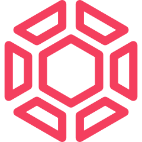

<p align="center">
  
</p>

<h1 align="center">Cogram</h1>

<p align="center"><strong>Intent-Aware Context Memory for LLM Agents</strong></p>

<p align="center">
  <a href="LICENSE"></a>
  <a href="https://github.com/srk0102/cogram/pkgs/container/cogram-mcp"></a>
  <a href="https://github.com/srk0102/cogram/pkgs/container/cogram-dashboard"></a>
  <a href="https://github.com/srk0102/cogram/actions/workflows/docker-publish.yml"></a>
  <a href="https://github.com/srk0102/cogram"></a>
</p>

> **Note**
>
> Cogram is a **fork of [Graphiti](https://github.com/getzep/graphiti)** by Zep AI Research, with an intent-capture layer baked in directly. Where graphiti gives you a temporal context graph, cogram extends every fact with **why it exists**, **what goal it serves**, and **how the user thinks** — a pre-synthesized model that any LLM agent can consume across surfaces.

⭐ Help us reach more developers and grow the community. Star this repo!

> **Tip**
>
> Cogram ships an MCP server out of the box. Connect Claude Desktop, Cursor, Windsurf, or any MCP client to give your agent persistent intent-aware memory.

---

Cogram is a framework for building and querying **intent graphs** — temporal context graphs that capture not just what facts exist, but *why* the user holds them and *what underlying goal* each fact serves. Built on a fork of Graphiti, cogram inherits temporal validity windows, multi-database driver support, and hybrid retrieval, then adds:

- **Per-edge intent annotation** (`why_connected`, `director_vision`, `cognitive_pattern`)
- **Per-entity narration** (`vllm_narrative` with stance and open questions)
- **DirectorProfile distillation** — a model of *how the user thinks*
- **Engram cache** (Postgres-backed) — repeat LLM calls cost zero
- **Redis active subgraph** (hot tier, <1ms reads)
- **Knot synthesis with local Gemma** — pre-compressed hub narratives at $0 marginal cost
- **MCP server** with 13 tools for Claude Desktop / Cursor / any agent

Use Cogram to:

- Build memory that **survives across surfaces** — Claude in your terminal, Claude in your browser, Cursor, custom GPT-4 agents — all reasoning the same way about your decisions because they share the same `why_connected` and `director_vision` for every fact.
- Forecloses wrong agent routes by recording the **principle behind a decision**, not just the rule.
- Query across time, meaning, relationships, *and intent* with hybrid retrieval (semantic + keyword + graph traversal + profile-aware Cypher).
- Pre-synthesize hub-node narratives **once with local Gemma**, reuse forever — agent cost approaches zero on warm reads.

---

## What is an Intent Graph?

An intent graph is a temporal context graph (à la Graphiti) **plus an intent layer**. Each edge carries not just a fact and a validity window, but the user's *reasoning* about that fact:

| Component | What it stores |
|---|---|
| **Entities (nodes)** | People, products, policies, concepts — with summaries that evolve over time |
| **Facts / Relationships (edges)** | Triplets (Entity → Relationship → Entity) with temporal validity windows |
| **Episodes (provenance)** | Raw data as ingested — every derived fact traces back here |
| **Custom Types (ontology)** | Developer-defined entity and edge types via Pydantic models |
| **★ `intent_meta` (per edge)** | `why_connected` (the reason this link exists), `director_vision` (the larger goal it serves), `cognitive_pattern` (the thinking style it reveals) |
| **★ `vllm_narrative` (per hub entity)** | Second-person narrative + user's stance + open questions + cognitive_pattern_label |
| **★ `:DirectorProfile` (top of graph)** | Distilled summary of *how* the user thinks — recurring visions, working-style summary, ranked cognitive patterns |
| **★ `:CognitivePattern` (aggregated)** | Reusable thinking labels (e.g. `legal risk mitigation`, `data-driven validation`) — reinforced by edges, decayed by inactivity |
| **★ `:knot_narrative` (per hub)** | Pre-synthesized prose paragraph from local Gemma — drop directly into LLM context |

★ = additions on top of Graphiti.

---

## Cogram and Graphiti

Cogram is a fork of Graphiti, the open-source temporal context graph engine by [Zep AI Research](https://www.getzep.com/). The forked graphiti code lives directly inside the `cogram/` package — no separate `graphiti-core` install. We track Graphiti's design and extend it with the intent layer.

### Cogram vs Graphiti

| Aspect | Graphiti | Cogram |
|---|---|---|
| What it is | OSS temporal context graph engine | OSS intent graph engine (fork of graphiti) |
| Per-edge `why_connected` / `director_vision` / `cognitive_pattern` | – | ✅ |
| Per-entity narration with stance + open questions | – | ✅ |
| DirectorProfile + CognitivePattern aggregation | – | ✅ |
| Pre-synthesized hub narratives (knots) | – | ✅ Gemma local + GPT fallback |
| Engram-style decision cache | – | ✅ Postgres-backed |
| Redis active subgraph (hot tier) | – | ✅ |
| MCP server (turnkey) | partial (separate `mcp_server` dir) | ✅ baked into core, 13 tools |
| Multi-DB drivers (Neo4j, FalkorDB, Kuzu, Neptune) | ✅ | ✅ inherited |
| Bi-temporal model with validity windows | ✅ | ✅ inherited |
| Hybrid BM25 + vector + graph retrieval | ✅ | ✅ inherited + profile-aware Cypher traversal |
| LLM providers (OpenAI / Anthropic / Gemini / Groq) | ✅ | ✅ inherited |
| Drift / contradiction handling | LLM-driven judgments | ✅ Cosine drift gate + classifier with 5× weight on contradictions |
| Confidence decay | basic | ✅ 30-day exponential half-life |
| PostHog telemetry | enabled by default | **disabled by default** — no analytics ping out |

### When to choose which

- Choose **Graphiti** if you want the lean temporal context graph engine and you're comfortable building the intent / agent / cache layers yourself.
- Choose **Cogram** if you want the same temporal substrate **plus** an intent layer that makes multi-surface agents reason consistently, plus a turnkey MCP server, plus a cache architecture that approaches zero cost on warm reads.

---

## Why Cogram?

Most LLM memory products store **what** the user said. When a different agent (Claude in your terminal vs. Claude in your browser vs. a custom GPT) reads the same memory, each invents its own reasoning around bare facts. The agents drift apart and recommend conflicting actions.

Cogram solves this by storing the **why** alongside the what. Every fact carries the user's reasoning, the larger goal it serves, and the thinking pattern it reveals. Any agent reading cogram converges on the same interpretation — they're forced into the same lane because they all see the same `why_connected` and `director_vision`.

This is **canonical multi-surface context** — not just memory.

### Concrete example: graphiti vs cogram on the same scenario

A user tells Claude: *"I rejected server-side LinkedIn scraping because of legal issues. We use a Chrome extension during the end-user's logged-in session instead."*

**Graphiti alone stores:**
```
(User) -[REJECTED]-> (server-side LinkedIn scraping)
       fact: "User rejected server-side LinkedIn scraping"
```

A future agent reading this thinks: *"Maybe the user will accept it now if I phrase it differently."* → **wrong route**.

**Cogram stores the same edge with intent_meta:**

```json
{
  "fact": "User rejected server-side LinkedIn scraping",
  "intent_meta": {
    "why_connected": "Server-side scraping conflicts with LinkedIn ToS, creating legal risk",
    "director_vision": "Build a legally compliant AI recruitment platform",
    "cognitive_pattern": "legal risk mitigation"
  }
}
```

A future agent in any interface reasons: *"User's vision is legal compliance. So scraping Indeed via residential proxies would be rejected by the same logic, even though we never specifically discussed Indeed."* → **right route, every time, across every surface**.

### Cogram vs other memory products

| Aspect | mem0 | Zep | Letta | Cogram |
|---|---|---|---|---|
| Stores facts | ✅ | ✅ | ✅ | ✅ |
| Temporal validity windows | – | ✅ | – | ✅ inherited from graphiti |
| **Per-edge intent (why+vision+pattern)** | ❌ | ❌ | ❌ | ✅ |
| Per-entity narration with stance | ❌ | ❌ | ❌ | ✅ |
| Distilled "how the user thinks" profile | ❌ | partial | – | ✅ |
| Pre-synthesized agent-ready paragraphs | ❌ | ❌ | ❌ | ✅ Gemma local |
| Cost on warm reads | scales with LLM | scales with LLM | scales | **near zero** (Engram cache) |
| MCP server | partial | – | – | ✅ 13 tools |
| Self-hostable / OSS | ✅ | hosted SaaS only | ✅ | ✅ Apache 2.0 |

---

## Requirements

- **Docker** (Compose v2) — for the simplest install path
- **OpenAI API key** — for entity extraction, intent annotation, narration, profile distillation
- **(Optional) Ollama** with `gemma3n:e4b` model pulled — for free local knot synthesis (falls back to gpt-4o-mini if not available)

For Python development:
- Python 3.10 or higher
- One of: Neo4j 5.26 / FalkorDB 1.1.2 / Kuzu 0.11.2 / Amazon Neptune

> **Important**
>
> Cogram works best with LLM services that support Structured Output (OpenAI, Gemini). Other services may produce inconsistent intent_meta and narrative schemas, particularly with smaller models.

> **Tip**
>
> The simplest way to try cogram is via Docker — no Python install needed. Three commands and you're running:

---

## Quick Start

### Run cogram in 3 commands (no clone needed)

```bash
mkdir cogram && cd cogram
curl -O https://raw.githubusercontent.com/srk0102/cogram/master/docker-compose.yml
curl -O https://raw.githubusercontent.com/srk0102/cogram/master/.env.example
mv .env.example .env       # edit, paste your OPENAI_API_KEY
docker compose pull && docker compose up -d
```

Five containers come up. Cogram MCP at `http://localhost:7800/mcp/`. Dashboard at `http://localhost:7801`.

| Service | Port | Image | Role |
|---|---|---|---|
| `cogram-mcp` | 7800 | `ghcr.io/srk0102/cogram-mcp:latest` | MCP server (stdio + HTTP/SSE) |
| `cogram-dashboard` | 7801 | `ghcr.io/srk0102/cogram-dashboard:latest` | Live force-graph viz |
| `cogram-neo4j` | 7474 / 7687 | `neo4j:5.26` | Graph (cold tier) |
| `cogram-postgres` | 5432 | `postgres:16-alpine` | Engram cache (warm tier) |
| `cogram-redis` | 6379 | `redis:7-alpine` | Active subgraph + events (hot tier) |

### Optional: enable local Gemma for free knot synthesis

```bash
ollama pull gemma3n:e4b   # ~7.5 GB; runs on CPU or GPU
ollama serve              # if not auto-started
```

Cogram automatically uses it for hub narratives when reachable at `http://host.docker.internal:11434`. Falls back to `gpt-4o-mini` otherwise.

### For developers — clone the source

```bash
git clone https://github.com/srk0102/cogram.git
cd cogram
cp .env.example .env       # paste OPENAI_API_KEY
docker compose up -d       # builds locally instead of pulling from ghcr.io
```

The `docker-compose.yml` uses both `image:` (ghcr.io pull) and `build:` (source build) — the same compose file works either way.

### Daily commands

```bash
docker compose up -d                # start everything
docker compose down                 # stop (volumes preserved)
docker compose down -v              # stop + wipe ALL data (destructive)
docker compose logs -f cogram-mcp   # tail server logs
docker compose pull                 # update to latest images
```

---

## Connect Claude Desktop

Edit `claude_desktop_config.json`:
- Windows: `%APPDATA%/Claude/claude_desktop_config.json`
- macOS: `~/Library/Application Support/Claude/claude_desktop_config.json`

```json
{
  "mcpServers": {
    "cogram": {
      "command": "npx",
      "args": ["-y", "mcp-remote", "http://localhost:7800/mcp/"]
    }
  }
}
```

Restart Claude Desktop. Cogram tools appear:

| Tool | Purpose |
|---|---|
| `add_episode(content, group_id)` | Write a fact; pipeline fires async |
| `record_fact(subject, predicate, object)` | Atomic SPO fact for foundational principles |
| `search_graph(query, group_id)` | Profile-aware retrieval, Redis-cached |
| `find_connections(entity_name)` | All edges touching an entity |
| `recent_episodes(entity_name, n)` | Recent episodes mentioning an entity |
| `get_episode(uuid)` | Full content of one episode |
| `get_director_profile(group_id)` | DirectorProfile + cognitive patterns + per-pattern WHY examples |
| `get_unified_profile()` | Cross-group merged profile |
| `get_knot(entity_name, format)` | Pre-synthesized hub narrative + raw subgraph |
| `list_cognitive_patterns(group_id)` | Distinct cognitive patterns + edge counts |
| `confidence(entity_name)` | Decayed effective confidence + label |
| `retract(target, reason)` | Mark fact wrong; cascades through profile + caches |
| `dedup_patterns(group_id)` | Embed + merge near-duplicate cognitive patterns |

---

## MCP Server

The `containers/cogram-mcp/` directory contains the MCP server implementation. Built on FastMCP with both **stdio** and **Streamable HTTP/SSE** transports on port 7800.

Key features:
- 13 MCP tools for episode write, retrieval, profile, knot, retraction, dedup
- Async pipeline — MCP returns in ~3s, full pipeline (intent + narration + profile + knot) runs in background ~15s
- Engram cache wraps every LLM call — repeats are free
- Redis active subgraph cache populates on first search per group_id

---

## Dashboard

The `containers/cogram-dashboard/` directory ships a FastAPI + force-graph visualization at `http://localhost:7801`. Features:

- Live entity/edge counts via Redis pub/sub (no polling)
- 2D force-directed graph rendering of your knowledge graph
- Per-tier metrics: Engram cache hits, Redis active subgraphs, knots synthesized
- Trainer status panel (when training profile enabled)

---

## Database Configuration

Cogram inherits Graphiti's pluggable graph driver layer. By default, the Docker stack runs Neo4j 5.26. To use a different backend in code:

### Neo4j with custom database name

```python
from cogram import Cogram
from cogram.driver.neo4j_driver import Neo4jDriver

driver = Neo4jDriver(
    uri="bolt://localhost:7687",
    user="neo4j",
    password="password",
    database="my_custom_database",
)

cogram = Cogram(graph_driver=driver)
```

### FalkorDB

```python
from cogram import Cogram
from cogram.driver.falkordb_driver import FalkorDriver

driver = FalkorDriver(host="localhost", port=6379)
cogram = Cogram(graph_driver=driver)
```

### Kuzu (embedded)

```python
from cogram import Cogram
from cogram.driver.kuzu_driver import KuzuDriver

driver = KuzuDriver(db="/tmp/cogram.kuzu")
cogram = Cogram(graph_driver=driver)
```

### Amazon Neptune

```python
from cogram import Cogram
from cogram.driver.neptune_driver import NeptuneDriver

driver = NeptuneDriver(
    host="<NEPTUNE_ENDPOINT>",
    aoss_host="<AMAZON_OPENSEARCH_SERVERLESS_HOST>",
)
cogram = Cogram(graph_driver=driver)
```

---

## Using Cogram with different LLM providers

### OpenAI (default)

Set `OPENAI_API_KEY` in `.env`. Cogram defaults to `gpt-4o-mini` for extraction, intent annotation, narration, and profile distillation.

### Local Gemma via Ollama (recommended for knot synthesis)

```bash
ollama pull gemma3n:e4b
```

In `.env`:
```bash
GEMMA_BASE_URL=http://host.docker.internal:11434/v1
GEMMA_MODEL=gemma3n:e4b
```

Cogram uses Gemma for hub narrative synthesis only. All other LLM calls stay on OpenAI for structured-output reliability. Falls back to `gpt-4o-mini` if Ollama unreachable.

### Anthropic / Gemini / Groq

Cogram inherits Graphiti's multi-provider support. Set the appropriate API key and pass an alternate `LLMClient` to the `Cogram` constructor:

```python
from cogram import Cogram
from cogram.llm_client.anthropic_client import AnthropicClient, LLMConfig

cogram = Cogram(
    "bolt://localhost:7687", "neo4j", "password",
    llm_client=AnthropicClient(config=LLMConfig(
        api_key="<your-anthropic-key>",
        model="claude-sonnet-4-5-latest",
    )),
)
```

> **Important**
>
> Cogram pipelines are concurrent by design. The `RATE_LIMIT_PER_MIN` env var (default 150) caps requests per minute to avoid 429 errors from your LLM provider. Tune up or down depending on your tier.

---

## Cost characteristics

| Pattern | Per write | Per read | Notes |
|---|---|---|---|
| First episode in fresh group | ~10–25s, ~$0.005 | – | Full pipeline fires |
| Episode N+1 with cache warmup | ~3s, ~$0.001 | – | Engram hits compound |
| Repeat search on same group | – | <1ms (Redis hot) | Active subgraph cached |
| `get_director_profile` after first call | – | <5ms | Redis JSON cache + single Cypher |
| Knot resynthesis (delta-gated) | ~3s, ~$0 if Gemma local | – | Rate-capped 5/hr/group |

Five env-tunable knot detection parameters bound the worst-case cost mathematically:

```bash
COGRAM_HARD_DEGREE_FLOOR=5
COGRAM_MIN_KNOT_SCORE=6.0
COGRAM_MAX_KNOTS_PER_GROUP=25
COGRAM_RESYNTHESIS_DELTA=3.0
COGRAM_RESYNTHESIS_RATE_CAP_PER_HOUR=5
```

Knots can't proliferate, re-synthesis can't thrash.

---

## Telemetry

**Cogram disables Graphiti's built-in PostHog telemetry by default.** You can opt back in by setting `GRAPHITI_TELEMETRY_ENABLED=true`.

### What Graphiti's upstream telemetry collects (when enabled)

- Anonymous UUID stored at `~/.cache/graphiti/telemetry_anon_id`
- OS, Python version, system architecture
- Graphiti version
- LLM provider type (OpenAI, Azure, Anthropic, etc.)
- Database backend (Neo4j, FalkorDB, Kuzu, Neptune)
- Embedder provider

### What is never collected

- Personal information or identifiers
- API keys or credentials
- Your actual data, queries, or graph content
- IP addresses or hostnames
- File paths or system-specific information
- Any content from your episodes, nodes, or edges

### Disabling completely (default)

Cogram sets `GRAPHITI_TELEMETRY_ENABLED=false` automatically in `cogram/__init__.py`. To enable:

```bash
export GRAPHITI_TELEMETRY_ENABLED=true
```

Cogram itself ships **no additional telemetry** of its own.

---

## Architecture

For deep architectural details — the five LLM call types, the three storage tiers, the post-write pipeline flow, the cost-bound parameters — see [docs/architecture.md](docs/architecture.md).

---

## Status

**Beta.** Verified end-to-end:
- Async pipeline fires on every `add_episode` (~3s MCP latency, ~15s background)
- Engram cache + Redis active subgraph wired and active
- Knot detection + Gemma synthesis with `gpt-4o-mini` fallback
- 20 MCP tools functional (16 graph tools + 4 task management tools)
- Public Docker images on ghcr.io, anonymous pull works

**Known limitations:**
- ~~LLM annotator can confuse "context" with "user intent" on edges that mention competitors.~~ **Mitigated in v0.2** by the `edge_kind` taxonomy (`principle` / `action` / `context` / `competitor` / `unknown`) — context and competitor edges no longer pollute the Director profile. See [docs/annotator_flaw.md](docs/annotator_flaw.md) for the full write-up.
- Trainer container (T2 LoRA per-node adapters) is opt-in via `docker compose --profile training up`, deferred until ≥50 samples per node.
- Task registry is process-local in-memory; horizontal scale-out needs sticky routing per group_id.

**Shipped in v0.2:**
- `edge_kind` field in `intent_meta` (`principle` / `action` / `context` / `competitor` / `unknown`) — see [docs/annotator_flaw.md](docs/annotator_flaw.md)
- Background pipeline task registry + 4 new MCP tools: `list_add_memory_tasks`, `get_add_memory_task_status`, `wait_for_add_memory_task`, `cancel_add_memory_task`

**Roadmap (v0.3+):**
- Opt-in MCP tool to backfill `edge_kind` on legacy edges with a before/after diff of cognitive patterns
- Weighted distillation (instead of filtering): `principle=1.0`, `action=0.7`, `unknown=0.3`, `context/competitor=0.0`
- Entity-level `is_director_owned` flag so the annotator distinguishes Director's own products from external tools
- Inline cogram value-add deeper into graphiti's hot-path functions
- T2 LoRA training activation
- REST API for non-MCP clients
- Hosted SaaS option

---

## License

Apache 2.0. See [LICENSE](LICENSE).

This is a fork of [Graphiti](https://github.com/getzep/graphiti) by Zep AI Research, Inc. (Apache 2.0). Per Apache §4(d), redistributions must preserve the [NOTICE](NOTICE) file. Forks must additionally credit Cogram (this repo) and Graphiti (the upstream) in their README and any user-facing surface — see [ATTRIBUTION.md](ATTRIBUTION.md) for plain-language rules.

---

## Contributing

Issues / PRs welcome at [github.com/srk0102/cogram](https://github.com/srk0102/cogram). For substantial contributions, please open an issue first to discuss the approach.

When contributing graphiti upstream changes (driver fixes, new providers), please credit the original graphiti contributors in the commit message and link the upstream PR.

---

## Support

Open an issue at [github.com/srk0102/cogram/issues](https://github.com/srk0102/cogram/issues) for bugs and feature requests.
